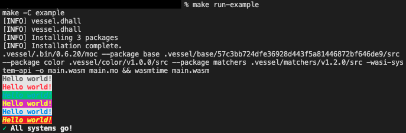

# motoko-color

A library for styling your terminal in Motoko!


<br/>
<br/>
<br/>

## Getting started
<br/>

Easy to use, expressive API:
```motoko
import Writer "mo:color/Writer";
import TextStyle "mo:color/TextStyle";

let { backgroundColor; textColor } = TextStyle;

let writer = Writer.Writer();

writer
  .text("hello world")
  .textColor(textColor.black)
  .backgroundColor(backgroundColor.white)
  .bold(true)
  .print();
```

Chain multiple colors on the same line:
```motoko
...
import Debug "mo:base/Debug";

Debug.print(
  writer
    .text("It's easy being green")
    .textColor(textColor.green)
    .read()
  # ", however... " #
  writer
    .text("I really love purple backgrounds!")
    .backgroundColor(backgroundColor.purple)
    .read()
);
```
      
Use RGB colors for the text or background:
```motoko
writer
  .text("woah dude, RGB!")
  .textColorRGB(20,40,60)
  .backgroundColorRGB(180,200,220)
  .print();
```

Immutable text styling settings, so use it all over the place, and don't worry about overwriting a bound setting.
```motoko
let greenCheckMark = writer
  .text("✓")
  .textColor(textColor.green)
  .backgroundColor(backgroundColor.white);
let redCheckMark = greenCheckMark
  .textColor(textColor.red);

greenCheckMark.print();
redCheckMark.print();
```
<br/>

## Documentation

Further documentation for the latest release can be found at [https://byronbecker.github.io/motoko-color](https://byronbecker.github.io/motoko-color).

If you'd like to generate documentation locally run $(vessel bin)/mo-doc && firefox docs/index.html
<br/>
<br/>

## Example
See the [example folder](https://github.com/ByronBecker/motoko-color/tree/main/example) for usage,
making sure that both [vessel](https://github.com/dfinity/vessel) and [wasmtime](https://wasmtime.dev/) are installed before running `make run-example` from the root directory.

<br/>
<br/>
<br/>
<br/>

## Credits
Credits to [Christopher Hegemann](https://github.com/kritzcreek) for [motoko-library-template](https://github.com/kritzcreek/motoko-library-template) that helped jumpstart this library
<br/>
<br/>

## License

motoko-color is distributed under the terms of the Apache License (Version 2.0).

See LICENSE for details.
